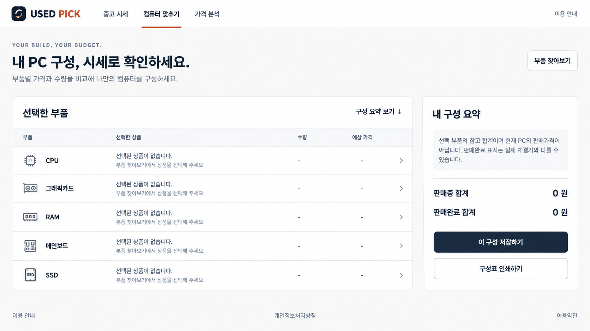
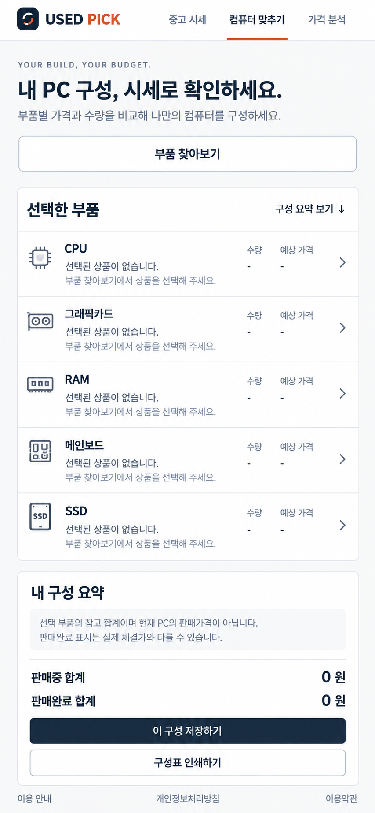

# USED PICK 전문 UI 정돈안

작성일: 2026-09-19

구현 기준: 운영 중인 `ui-a-v2`

목표: 현재 정보 구조와 사용 흐름은 유지하고, 시각 완성도만 전문 가격 비교 서비스 수준으로 정돈한다.

## 참조 이미지

### 데스크톱

### 모바일

두 이미지는 최종 픽셀 명세가 아니라 시각 방향이다. 이미지에 보이는 장식 아이콘, 열 이름, 문구가 현재 제품 계약과 다르면 현재 제품의 DOM, 기능, 데이터 의미를 우선한다. 새 기능이나 새 데이터를 이미지에서 추론해 추가하지 않는다.

## 한 줄 방향

지금의 친숙한 `ui-a-v2` 골격은 그대로 두고, 정렬·타이포·선·여백·가격 강조만 정교하게 다듬는다. 카드와 설명을 늘리지 않는다.

## 절대 보존 범위

다음은 디자인 작업의 변경 대상이 아니다.

- 상단 내비게이션 구조와 경로
- 홈의 카테고리 분리와 카테고리별 URL
- 검색어, 제조사, 세대, 소켓, 규격, 사이트, 정렬 필터의 현재 동작
- 모델 선택 dialog와 키보드/포커스 흐름
- 컴퓨터 맞추기의 부품 순서, 수량, 저장, 인쇄, 부분 합계 흐름
- 판매중 가격과 판매완료 표시가의 분리
- publication/window/currency 혼합 방지와 오류 상태
- 실제 데이터가 없을 때 0원이나 0표본을 꾸며내지 않는 규칙
- 가격 분석의 표본, 기간, 출처, 차트 의미
- API 요청, 카탈로그 분류, 가격 계산, 저장 데이터 형식

특히 아래 파일의 데이터 계약은 시각 작업 때문에 되돌리거나 단순화하지 않는다.

- `web-backend/public/pc-tools-data.mjs`
- `web-backend/public/pc-tools-catalog.mjs`
- `web-backend/public/pc-tools-core.mjs`
- `market/logic/pc-price-readiness.mjs`

## 사용자가 느껴야 하는 변화

- 첫 화면에서 “중고 PC 부품 시세를 확인하는 서비스”라는 성격이 바로 보인다.
- 주요 행동과 현재 선택 상태가 선명하지만 과장되지 않는다.
- 표와 가격은 숫자를 빠르게 비교하기 쉽다.
- 빈 상태, 로딩, 오류, 표본 부족이 서로 명확히 다르다.
- 데스크톱은 넓고 안정적이며, 모바일은 같은 순서로 자연스럽게 한 열로 접힌다.
- 광고는 본문이나 주요 행동보다 먼저 눈에 들어오지 않는다.

## 시각 시스템

### 색상

| 역할 | 권장값 | 사용 규칙 |
|---|---:|---|
| 배경 | `#F7F8FA` | 페이지 전체의 따뜻한 회백색 |
| 표면 | `#FFFFFF` | 실제로 구분이 필요한 패널에만 사용 |
| 주 텍스트 | `#10243E` | 제목, 가격, 주요 레이블 |
| 보조 텍스트 | `#607086` | 설명, 메타데이터 |
| 구분선 | `#DCE2E9` | 표 행, 섹션 경계, 입력 테두리 |
| 강조 | `#C64E2F` | 활성 내비게이션과 작은 핵심 포인트 |
| 주 행동 | `#142E4A` | 저장 등 한 화면의 단일 primary action |
| 성공 | `#247A52` | 정상/충족 상태에만 사용 |
| 주의 | `#A86618` | 표본 부족이나 주의 상태 |
| 오류 | `#B33A3A` | 실제 실패와 복구 안내 |

기존 로고와 terracotta 강조색은 유지한다. 새 그라데이션과 장식용 색상은 추가하지 않는다.

### 타이포그래피

- 시스템 한국어 산세리프 스택을 유지한다.
- 페이지 제목: 데스크톱 `34–40px`, 모바일 `28–32px`, `font-weight: 750–800`.
- 섹션 제목: `20–24px`, `font-weight: 700–750`.
- 본문: `15–16px`, 줄높이 `1.55–1.7`.
- 메타/보조: `13–14px`; 12px 아래로 내리지 않는다.
- 가격과 수량에는 `font-variant-numeric: tabular-nums`를 적용한다.
- 영문 eyebrow는 한 화면에 한 번만 사용한다.

### 간격과 크기

- 기본 간격 단위: `4px`.
- 페이지 좌우 여백: 데스크톱 `32px`, 태블릿 `24px`, 모바일 `16px`.
- 주요 섹션 간격: `32–48px`; 관련 항목 내부는 `8–20px`.
- 버튼/입력 최소 높이: 데스크톱 `42px`, 모바일 `44px`.
- 콘텐츠 최대 폭: `1280–1360px`.
- 데스크톱 builder: 본문 `minmax(0, 3fr)`, 요약 `320–360px`.

### 표면과 테두리

- 실제 독립 패널만 흰 배경과 `1px` 테두리를 갖는다.
- radius는 `6–10px`; 모든 요소를 둥근 카드로 만들지 않는다.
- 기본 그림자는 없거나 `0 1px 2px rgba(16, 36, 62, .04)` 수준으로 제한한다.
- 목록 행은 카드로 쪼개지 말고 하나의 표면 안에서 선으로 구분한다.
- pill은 상태나 짧은 필터 값에만 사용한다. 단순 문장을 pill로 감싸지 않는다.

## 페이지별 정돈안

### 공통 헤더

- 로고, 세 개의 핵심 내비게이션, 이용 안내 순서를 유지한다.
- 활성 메뉴는 terracotta 하단선과 굵기 차이만 사용한다.
- 헤더 높이는 데스크톱 `72–78px`, 모바일은 두 줄이 되어도 전체 `96px` 안을 목표로 한다.
- 모바일에서 메뉴를 아이콘이나 햄버거로 바꾸지 않는다. 현재 주요 경로가 바로 보이는 장점을 유지한다.

### 중고 시세 홈

- 현재 카테고리 분리와 검색/필터 흐름을 그대로 둔다.
- 페이지 제목, 검색, 카테고리, 결과 목록 순서를 바꾸지 않는다.
- 검색과 핵심 필터는 한 시각 그룹으로 정렬하고, 보조 필터는 현재의 접힘/모바일 dialog 동작을 유지한다.
- 선택된 카테고리는 색보다 하단선, 글자 굵기, 명확한 focus ring으로 표현한다.
- 결과는 카드 묶음보다 표/목록 리듬을 우선하며 가격과 출처 열을 정렬한다.
- 같은 안내 문장을 상단, 필터 아래, 빈 상태에 반복하지 않는다.

### 컴퓨터 맞추기

- 데스크톱의 왼쪽 선택 부품 영역과 오른쪽 구성 요약 구조를 유지한다.
- 부품 행은 `부품명 → 선택 모델/빈 상태 → 수량 → 가격/선택 행동`의 읽기 순서를 갖게 정렬한다.
- 현재 `+ 부품 선택` 버튼과 model picker dialog 흐름을 보존한다. 참조 이미지의 chevron은 기존 버튼의 시각 표현 후보일 뿐 별도 navigation이 아니다.
- 판매중/판매완료 합계를 명확히 분리하고, 값이 없으면 `—` 또는 현재 오류 문구를 유지한다. `0원`을 임의로 표시하지 않는다.
- 저장을 primary, 인쇄를 secondary로 유지한다.
- 호환성 안내는 선택 표 아래 한 번만 둔다.
- 모바일에서는 본문 다음에 요약을 배치한다. 고정 sidebar나 가로 스크롤 표를 만들지 않는다.

### 가격 분석

- 페이지 제목, 모델 문맥, 가격 상세, 출처 비교, 차트 순서를 유지한다.
- 대표 숫자와 단위를 같은 baseline에 정렬한다.
- 표본 수, 기간, 기준일은 대표 가격 바로 근처의 한 줄 메타로 묶는다.
- 출처 비교는 실제 개별 출처 값만 보여 주며 집계값을 반복하지 않는다.
- 차트가 주인공이므로 주변에 설명 카드나 장식 배지를 추가하지 않는다.
- 데이터 gap, 오류, 표본 부족은 기존 의미를 유지하면서 색과 한 줄 문구로 구분한다.

### 카테고리 랜딩·안내·법적 문서

- `/categories`와 `/categories/{slug}` 분리는 유지한다.
- 카테고리 랜딩은 제목, 짧은 소개, 분류 목록의 단순 계층을 유지한다.
- 안내/개인정보/약관은 읽기 폭 `720–780px`, 제목 간격, 구분선만 정돈한다.
- 마케팅 카드나 긴 소개 섹션을 새로 만들지 않는다.

## 상태 표현

| 상태 | 표현 |
|---|---|
| 로딩 | 기존 자리의 짧은 skeleton 또는 `확인 중`; 레이아웃 이동 최소화 |
| 빈 선택 | `선택된 상품이 없습니다`와 기존 선택 행동 |
| 표본 부족 | 주의색과 현재의 정확한 원인 문구; 가격을 0으로 표시하지 않음 |
| API 오류 | 오류색, 짧은 복구 문구, 재시도 가능 시에만 재시도 행동 |
| 선택됨 | 모델명과 가격 강조, 제거/변경 행동은 보조 수준 |
| 저장 성공 | 짧은 status message; 저장 실패를 성공처럼 보이지 않음 |

## 접근성과 반응형

- 모든 interactive element에 `:focus-visible` 2px outline을 유지한다.
- 본문과 배경 대비는 WCAG AA 이상을 목표로 한다.
- 390px에서 문서 전체 가로 스크롤이 없어야 한다.
- 표가 좁아지면 열을 숨겨 의미를 잃지 말고, 현재 mobile row 구조로 재배치한다.
- dialog는 `Escape`, 닫기 버튼, focus return을 유지한다.
- `prefers-reduced-motion`에서는 장식 transition을 제거한다.
- 클릭 영역은 최소 44×44px을 확보한다.

## 구현 순서

1. 현재 `ui-a-v2` 화면을 desktop 1440px, mobile 390px으로 캡처해 기준을 고정한다.
2. `ui-concept-a.css`의 색상·타입·간격 토큰부터 정리한다.
3. 공통 헤더와 focus/버튼/입력 규칙을 맞춘다.
4. 컴퓨터 맞추기에서 행 정렬과 요약 rail만 정돈한다.
5. 홈 목록과 필터의 같은 토큰을 적용한다.
6. 가격 분석과 문서 페이지를 동일 시스템으로 맞춘다.
7. 기능 코드 변경 없이 렌더링을 비교한다. 불가피한 DOM 수정은 기존 ID, 이벤트, 접근성 이름을 보존한다.
8. 결정론 테스트와 실제 브라우저의 desktop/mobile 흐름을 모두 확인한다.

## 수정 허용/금지 가이드

허용:

- CSS 변수, 간격, 정렬, 글자 크기/굵기, 색, 테두리, focus style
- 의미가 같은 범위의 짧은 UI 문구 정리
- 접근성에 필요한 label/heading 보완
- 기존 이벤트와 ID를 보존하는 최소 DOM wrapper 조정

금지:

- 검색·필터·분류·가격 계산 로직 변경
- 카테고리 추가/삭제/통합
- API 응답을 UI 편의상 재해석
- 판매중과 판매완료 값 통합
- 새 dashboard, 추천, 점수, 차트, 공유 기능 추가
- mockup에만 있는 요소를 데이터 기능으로 구현
- CSS 편의를 위한 전체 DOM 재작성

## 완료 기준

- `scripts/verify.ps1` 통과
- 기존 UI 계약과 publication/scope 안전 계약 통과
- 1440×900과 390×844에서 시각 캡처 비교 완료
- 홈에서 카테고리 이동, 검색, 제조사/규격 필터, 정렬 동작 확인
- builder에서 9개 부품 dialog, 검색, 선택, 수량, 제거, 저장, 인쇄 확인
- 가격 분석에서 모델 문맥, 표본/기간, 출처, 차트 gap 확인
- console error 없음, 페이지 전체 가로 overflow 없음
- 한 화면에서 같은 설명이 의미상 두 번 이상 반복되지 않음
- 불필요한 카드, pill, 둥근 wrapper, 그림자 증가 없음

## 작업자용 핵심 체크

> 이미지를 그대로 복제하지 말고, 현재 `ui-a-v2`의 동작과 데이터 계약 위에 이미지의 정렬·톤·밀도만 적용한다. 기능 차이가 생기면 현재 구현이 항상 우선한다.
